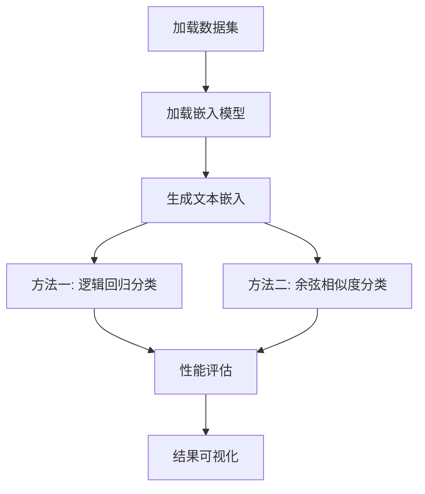

# 嵌入分类任务指南

## 🎯 概述
本文档详细说明了使用Sentence Transformer进行文本嵌入分类的完整流程，包含代码逻辑、设计思路和通用模板。

---

## 📚 目录
1. [核心概念](#核心概念)
2. [项目架构](#项目架构)
3. [代码逻辑流程](#代码逻辑流程)
4. [两种分类方法详解](#两种分类方法详解)
5. [通用代码模板](#通用代码模板)
6. [扩展和优化](#扩展和优化)
7. [常见问题解决](#常见问题解决)

---

## 核心概念

### 什么是嵌入分类？
**嵌入分类**是一种现代NLP方法，将文本转换为高维向量表示（嵌入），然后在这些向量上进行分类。

### 工作原理
```
原始文本 → Sentence Transformer → 嵌入向量 → 分类器 → 预测结果
```

### 优势
- **语义理解**：捕获文本的深层语义信息
- **预训练优势**：利用大规模预训练模型的知识
- **通用性强**：同一套流程适用于多种文本分类任务
- **效果优秀**：通常比传统方法效果更好

---

## 项目架构

### 文件组织结构
```
llm-introduction/
├── utils/                          # 工具模块
│   ├── __init__.py                 # 模块初始化
│   └── data_builder.py             # 数据管理工具
├── classification task/            # 分类任务目录
│   ├── embedding_classification.py # 主分类脚本
│   ├── requirements.txt           # 依赖包列表
│   └── README.md                  # 任务说明文档
└── .gitignore                     # 忽略大文件
```

### 核心依赖包
```
sentence-transformers  # 句子嵌入模型
scikit-learn          # 机器学习工具
pandas               # 数据处理
numpy                # 数值计算
matplotlib           # 可视化
seaborn              # 统计可视化
datasets             # Hugging Face数据集
torch                # PyTorch深度学习框架
```

---

## 代码逻辑流程

### 1. 整体流程图


### 2. 详细步骤分解

#### 步骤1: 数据加载模块
```python
def load_data():
    """
    功能：加载和预处理数据集
    输入：无（从utils模块获取）
    输出：包含train/validation/test的数据集字典
    """
    # 调用utils.get_dataset()获取Rotten Tomatoes数据
    # 检查数据完整性
    # 返回结构化数据
```

#### 步骤2: 模型加载模块
```python
def load_embedding_model():
    """
    功能：加载预训练的Sentence Transformer模型
    输入：无
    输出：SentenceTransformer模型实例
    """
    # 加载'sentence-transformers/all-mpnet-base-v2'
    # 该模型输出768维向量
    # 支持多语言，效果优秀
```

#### 步骤3: 嵌入生成模块
```python
def generate_embeddings(model, data):
    """
    功能：将文本转换为嵌入向量
    输入：模型实例、文本数据
    输出：训练集和测试集的嵌入矩阵
    """
    # 批量处理文本
    # 显示进度条
    # 返回numpy数组格式的嵌入
```

#### 步骤4A: 逻辑回归分类模块
```python
def train_logistic_regression(train_embeddings, train_labels):
    """
    功能：训练监督学习分类器
    输入：训练集嵌入、训练集标签
    输出：训练好的分类器
    """
    # 使用sklearn.LogisticRegression
    # 设置random_state保证结果可重现
    # 在嵌入向量上训练线性分类器
```

#### 步骤4B: 余弦相似度分类模块
```python
def cosine_similarity_classification(train_embeddings, train_labels, test_embeddings):
    """
    功能：基于相似度的无监督分类
    输入：训练集嵌入、标签、测试集嵌入
    输出：预测标签
    """
    # 计算每个类别的平均嵌入向量
    # 计算测试样本与类别中心的余弦相似度
    # 选择相似度最高的类别作为预测
```

#### 步骤5: 评估模块
```python
def evaluate_performance(y_true, y_pred, method_name):
    """
    功能：全面评估分类性能
    输入：真实标签、预测标签、方法名称
    输出：评估报告和可视化图表
    """
    # 计算准确率、精确率、召回率、F1分数
    # 生成分类报告
    # 创建和保存混淆矩阵图像
```

---

## 两种分类方法详解

### 方法一：逻辑回归分类

#### 原理
在嵌入向量空间中训练线性分类器，学习最优的决策边界。

#### 核心代码逻辑
```python
# 1. 训练阶段
clf = LogisticRegression(random_state=42, max_iter=1000)
clf.fit(train_embeddings, train_labels)

# 2. 预测阶段  
predictions = clf.predict(test_embeddings)

# 3. 数学原理
# 对于每个测试样本x，计算：
# prediction = argmax(w·x + b)
# 其中w是权重向量，b是偏置
```

#### 优势
- **监督学习**：能充分利用标签信息
- **快速训练**：线性模型训练速度快
- **可解释性**：可以分析特征权重
- **泛化能力**：在大多数任务上表现稳定

#### 适用场景
- 有充足的标注数据
- 需要快速训练和预测
- 要求模型可解释

### 方法二：余弦相似度分类

#### 原理
计算测试样本与各类别中心点的相似度，选择最相似的类别。

#### 核心代码逻辑
```python
# 1. 计算类别中心
# 将嵌入和标签合并
df = pd.DataFrame(np.hstack([train_embeddings, labels.reshape(-1, 1)]))
# 按标签分组，计算每组的平均嵌入
class_centers = df.groupby(embedding_dim).mean().iloc[:, :-1].values

# 2. 计算相似度矩阵
similarity_matrix = cosine_similarity(test_embeddings, class_centers)

# 3. 选择最相似的类别
predictions = np.argmax(similarity_matrix, axis=1)

# 4. 数学原理
# 余弦相似度 = (A·B) / (||A|| * ||B||)
# 值域为[-1, 1]，1表示完全相同
```

#### 优势
- **无需训练**：直接基于几何距离计算
- **直观易懂**：基于相似度的自然思想
- **少样本友好**：在样本不足时仍能工作
- **计算高效**：只需矩阵运算

#### 适用场景
- 标注数据较少
- 需要快速原型验证
- 类别可以用中心点很好表示

---

## 通用代码模板

### 基础模板结构
```python
#!/usr/bin/env python3
# -*- coding: utf-8 -*-
"""
通用嵌入分类模板
适用于各种文本分类任务
"""

import sys
import numpy as np
import pandas as pd
from pathlib import Path
from sentence_transformers import SentenceTransformer
from sklearn.linear_model import LogisticRegression
from sklearn.metrics import classification_report, confusion_matrix
from sklearn.metrics.pairwise import cosine_similarity
import matplotlib.pyplot as plt
import seaborn as sns

class EmbeddingClassifier:
    """嵌入分类器通用类"""
    
    def __init__(self, model_name='sentence-transformers/all-mpnet-base-v2'):
        """初始化分类器"""
        self.model_name = model_name
        self.model = None
        self.classifier = None
        self.class_centers = None
        
    def load_model(self):
        """加载嵌入模型"""
        print(f"🤖 正在加载模型: {self.model_name}")
        self.model = SentenceTransformer(self.model_name)
        print("✅ 模型加载成功")
        return self
    
    def generate_embeddings(self, texts, show_progress=True):
        """生成文本嵌入"""
        if self.model is None:
            raise ValueError("请先调用load_model()加载模型")
        return self.model.encode(texts, show_progress_bar=show_progress)
    
    def train_supervised(self, train_texts, train_labels, **kwargs):
        """训练监督分类器"""
        print("🎯 训练监督分类器...")
        train_embeddings = self.generate_embeddings(train_texts)
        
        self.classifier = LogisticRegression(random_state=42, **kwargs)
        self.classifier.fit(train_embeddings, train_labels)
        print("✅ 监督分类器训练完成")
        return self
    
    def prepare_similarity_classifier(self, train_texts, train_labels):
        """准备相似度分类器"""
        print("🔄 准备相似度分类器...")
        train_embeddings = self.generate_embeddings(train_texts)
        
        # 计算类别中心
        df = pd.DataFrame(np.hstack([train_embeddings, 
                                   np.array(train_labels).reshape(-1, 1)]))
        self.class_centers = df.groupby(df.columns[-1]).mean().iloc[:, :-1].values
        print("✅ 相似度分类器准备完成")
        return self
    
    def predict_supervised(self, test_texts):
        """监督方法预测"""
        if self.classifier is None:
            raise ValueError("请先训练监督分类器")
        test_embeddings = self.generate_embeddings(test_texts)
        return self.classifier.predict(test_embeddings)
    
    def predict_similarity(self, test_texts):
        """相似度方法预测"""
        if self.class_centers is None:
            raise ValueError("请先准备相似度分类器")
        test_embeddings = self.generate_embeddings(test_texts)
        similarities = cosine_similarity(test_embeddings, self.class_centers)
        return np.argmax(similarities, axis=1)
    
    def evaluate(self, y_true, y_pred, method_name="", class_names=None):
        """评估性能"""
        print(f"\n📊 {method_name}性能评估:")
        print("=" * 50)
        
        report = classification_report(y_true, y_pred, 
                                     target_names=class_names, 
                                     digits=4)
        print(report)
        
        # 混淆矩阵可视化
        cm = confusion_matrix(y_true, y_pred)
        plt.figure(figsize=(8, 6))
        sns.heatmap(cm, annot=True, fmt='d', cmap='Blues',
                    xticklabels=class_names or range(len(np.unique(y_true))),
                    yticklabels=class_names or range(len(np.unique(y_true))))
        plt.title(f'{method_name}混淆矩阵')
        plt.ylabel('实际标签')
        plt.xlabel('预测标签')
        plt.show()

# 使用示例
def example_usage():
    """使用示例"""
    # 1. 创建分类器实例
    classifier = EmbeddingClassifier()
    
    # 2. 加载模型
    classifier.load_model()
    
    # 3. 准备数据（这里需要替换为实际数据）
    train_texts = ["正面文本示例", "负面文本示例"]
    train_labels = [1, 0]
    test_texts = ["待分类文本"]
    test_labels = [1]
    
    # 4. 训练和预测（监督方法）
    classifier.train_supervised(train_texts, train_labels)
    supervised_pred = classifier.predict_supervised(test_texts)
    
    # 5. 准备和预测（相似度方法）
    classifier.prepare_similarity_classifier(train_texts, train_labels)
    similarity_pred = classifier.predict_similarity(test_texts)
    
    # 6. 评估结果
    classifier.evaluate(test_labels, supervised_pred, "监督学习", ["负面", "正面"])
    classifier.evaluate(test_labels, similarity_pred, "相似度匹配", ["负面", "正面"])

if __name__ == "__main__":
    example_usage()
```

---

## 扩展和优化

### 1. 模型选择优化
```python
# 不同任务的推荐模型
RECOMMENDED_MODELS = {
    "中文文本": "sentence-transformers/paraphrase-multilingual-MiniLM-L12-v2",
    "英文文本": "sentence-transformers/all-mpnet-base-v2", 
    "短文本": "sentence-transformers/all-MiniLM-L6-v2",
    "长文本": "sentence-transformers/all-mpnet-base-v2",
    "代码文本": "microsoft/codebert-base"
}
```

### 2. 性能优化策略
```python
# 批处理优化
def batch_encode(texts, model, batch_size=32):
    """批量编码以提高效率"""
    embeddings = []
    for i in range(0, len(texts), batch_size):
        batch = texts[i:i+batch_size]
        batch_embeddings = model.encode(batch)
        embeddings.append(batch_embeddings)
    return np.vstack(embeddings)

# 缓存机制
import pickle
def save_embeddings(embeddings, filepath):
    """保存嵌入以避免重复计算"""
    with open(filepath, 'wb') as f:
        pickle.dump(embeddings, f)

def load_embeddings(filepath):
    """加载已保存的嵌入"""
    with open(filepath, 'rb') as f:
        return pickle.load(f)
```

### 3. 高级分类方法
```python
# 支持向量机
from sklearn.svm import SVC

def train_svm_classifier(train_embeddings, train_labels):
    """训练SVM分类器"""
    svm = SVC(kernel='rbf', random_state=42)
    svm.fit(train_embeddings, train_labels)
    return svm

# 随机森林
from sklearn.ensemble import RandomForestClassifier

def train_rf_classifier(train_embeddings, train_labels):
    """训练随机森林分类器"""
    rf = RandomForestClassifier(n_estimators=100, random_state=42)
    rf.fit(train_embeddings, train_labels)
    return rf

# 神经网络分类器
from sklearn.neural_network import MLPClassifier

def train_nn_classifier(train_embeddings, train_labels):
    """训练神经网络分类器"""
    nn = MLPClassifier(hidden_layer_sizes=(128, 64), random_state=42)
    nn.fit(train_embeddings, train_labels)
    return nn
```

### 4. 多分类策略
```python
def handle_multiclass(train_embeddings, train_labels, strategy='ovr'):
    """处理多分类问题"""
    from sklearn.multiclass import OneVsRestClassifier, OneVsOneClassifier
    
    base_classifier = LogisticRegression(random_state=42)
    
    if strategy == 'ovr':
        # 一对其余策略
        classifier = OneVsRestClassifier(base_classifier)
    elif strategy == 'ovo':
        # 一对一策略  
        classifier = OneVsOneClassifier(base_classifier)
    else:
        # 直接多分类
        classifier = base_classifier
    
    classifier.fit(train_embeddings, train_labels)
    return classifier
```

---

## 常见问题解决

### 1. 内存不足问题
```python
# 解决方案：分批处理
def encode_in_batches(texts, model, batch_size=16):
    """分批编码大量文本"""
    embeddings = []
    for i in tqdm(range(0, len(texts), batch_size)):
        batch = texts[i:i+batch_size]
        batch_emb = model.encode(batch, show_progress_bar=False)
        embeddings.append(batch_emb)
        
        # 释放内存
        if i % 1000 == 0:
            gc.collect()
    
    return np.vstack(embeddings)
```

### 2. 模型下载失败
```python
# 解决方案：离线模型或镜像源
import os
os.environ['HF_ENDPOINT'] = 'https://hf-mirror.com'

# 或使用本地模型
model = SentenceTransformer('/path/to/local/model')
```

### 3. 分类效果不佳
```python
# 解决方案：特征工程和模型调优
def feature_engineering(embeddings):
    """特征工程增强"""
    from sklearn.preprocessing import StandardScaler, PCA
    
    # 标准化
    scaler = StandardScaler()
    embeddings_scaled = scaler.fit_transform(embeddings)
    
    # 降维（可选）
    pca = PCA(n_components=0.95)  # 保留95%方差
    embeddings_reduced = pca.fit_transform(embeddings_scaled)
    
    return embeddings_reduced, scaler, pca

# 超参数调优
from sklearn.model_selection import GridSearchCV

def tune_hyperparameters(train_embeddings, train_labels):
    """超参数调优"""
    param_grid = {
        'C': [0.1, 1, 10, 100],
        'max_iter': [1000, 2000, 5000]
    }
    
    lr = LogisticRegression(random_state=42)
    grid_search = GridSearchCV(lr, param_grid, cv=5, scoring='f1_macro')
    grid_search.fit(train_embeddings, train_labels)
    
    return grid_search.best_estimator_
```

### 4. 类别不平衡问题
```python
# 解决方案：样本权重平衡
def handle_class_imbalance(train_embeddings, train_labels):
    """处理类别不平衡"""
    from sklearn.utils.class_weight import compute_class_weight
    
    # 计算类别权重
    classes = np.unique(train_labels)
    class_weights = compute_class_weight('balanced', 
                                       classes=classes, 
                                       y=train_labels)
    class_weight_dict = dict(zip(classes, class_weights))
    
    # 使用权重训练
    classifier = LogisticRegression(class_weight=class_weight_dict, 
                                  random_state=42)
    classifier.fit(train_embeddings, train_labels)
    
    return classifier
```

---

## 🎯 最佳实践总结

### 1. 开发流程
1. **数据探索**：了解数据分布和特点
2. **基线建立**：先用简单方法建立基线
3. **模型选择**：根据任务特点选择合适的嵌入模型
4. **方法对比**：同时尝试监督和无监督方法
5. **结果分析**：深入分析错误案例
6. **迭代优化**：基于分析结果持续改进

### 2. 代码组织
- **模块化设计**：将不同功能拆分为独立函数
- **配置管理**：使用配置文件管理超参数
- **日志记录**：记录训练过程和结果
- **异常处理**：优雅处理各种异常情况
- **文档完善**：为所有函数添加详细文档

### 3. 性能监控
- **交叉验证**：使用k-fold验证模型稳定性
- **多指标评估**：不只看准确率，关注精确率、召回率、F1
- **混淆矩阵分析**：识别分类错误模式
- **学习曲线**：分析模型是否过拟合或欠拟合

这个框架为您提供了完整的嵌入分类解决方案，可以根据具体任务需求进行调整和扩展。 